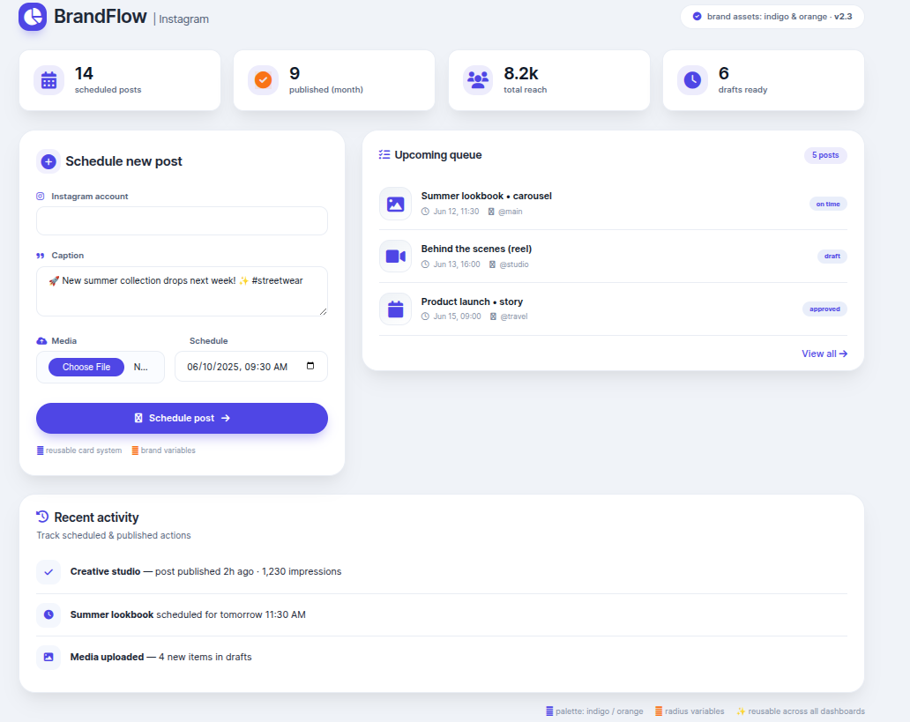
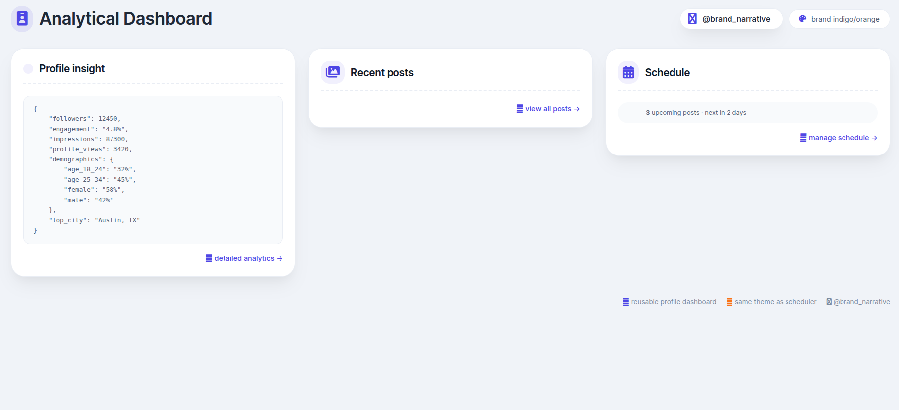

# 🤖 Autonomous Instagram Social Media Agent

An AI-driven Instagram management system that ingests profiles, analyzes content and audience patterns, generates strategy, schedules posts, creates captions, and publishes automatically via Instagram Graph API.

---

# 🎯 Purpose

The goal of this project is to build an **autonomous social media management agent** that can:

- Understand Instagram profiles and content history
- Extract strategic insights using AI
- Automatically plan posting schedules
- Generate content aligned with brand strategy
- Publish posts to Instagram
- Provide dashboard visibility

This system reduces manual social media management effort and enables data-driven content automation.

---

# ✅ Current Capacity

The system currently supports:

## 📷 Instagram Integration

- Connect Instagram Business account via Graph API
- Store credentials securely
- Publish scheduled posts

## 🧠 Profile Intelligence

- Import Instagram profile posts
- AI analysis of each post (ScaleDown)
- Aggregated profile strategy generation

## 📅 Autonomous Planning

- Strategy-based scheduling engine
- Automatic content generation
- Scheduled publishing

## 📊 Dashboard

- Profile insights visualization
- Recent posts display
- Scheduled content view

---

## 📸 Schedule Post — Dashboard Preview




---

# 🚀 Future Scope

Planned enhancements:

- Multi-account management
- Comment ingestion & auto-reply
- Analytics charts & engagement trends
- Approval workflow before publish
- Competitor analysis agent
- Optimal time prediction via ML
- Campaign planning calendar
- Reel & carousel publishing support
- Token auto-refresh system

---

# 🧭 Architecture Overview

The system follows an **AI-agent pipeline architecture**:

```
Instagram Import
      ↓
Post Analysis (ScaleDown)
      ↓
Profile Insight Aggregation
      ↓
Scheduling Engine
      ↓
Content Generation
      ↓
Publishing Engine (Graph API)
      ↓
Dashboard
```

Each stage enriches data with intelligence and passes it to the next.

---

# 🤖 Agents Used

## 1️⃣ Post Analysis Agent

Analyzes individual posts using AI.
**Outputs:** topic, intent, tone, summary, keywords

## 2️⃣ Profile Insight Agent

Aggregates post insights into strategy.
**Outputs:** content pillars, brand voice, audience type, strategy recommendations

## 3️⃣ Scheduling Agent

Creates posting schedule based on strategy.
**Outputs:** scheduled dates, posting frequency, content mix

## 4️⃣ Content Generation Agent

Creates captions aligned with strategy.
**Outputs:** captions, topics, hashtags

## 5️⃣ Publishing Agent

Publishes scheduled posts via Instagram Graph API.
**Outputs:** published IG media, status updates

---

# 🗄️ Models Used

Core database models:

- **Profile** — Instagram profile metadata
- **Post** — raw imported posts
- **PostInsight** — AI analysis per post
- **ProfileInsight** — aggregated strategy
- **InstagramAccount** — connected IG credentials
- **ScheduledPost** — planned/published content

---

# ⚙️ Backend Architecture

The backend follows a **Service + Job + Model architecture**:

```
Controllers
   ↓
Jobs (Queue)
   ↓
Services
   ↓
AI / Graph API
   ↓
Database
```

## Services

```
InstagramScraper
InstagramParser
InstagramGraphService
ScaleDownClient
PostAnalyzerAI
ProfileInsightAggregator
SchedulingService
ContentGenerator
InstagramPublisher
```

## Jobs

```
FetchInstagramPostsJob
AnalyzePostJob
AggregateProfileInsightsJob
GenerateScheduleJob
GenerateContentForScheduleJob
PublishScheduledPostsJob
```

---

# 🧱 Technologies & Versions

- PHP 8.x
- Laravel 10.x
- MySQL 8+
- ScaleDown API (GPT-4o)
- Instagram Graph API v19+
- Blade templates
- Laravel filesystem

---

# 📷 Instagram Requirements

To use publishing features:

- Instagram Professional account
- Linked Facebook Page
- Meta Developer App
- Instagram Graph API access token

---

# 📥 Installation & Usage

## 1️⃣ Clone Repository

```bash
git clone https://github.com/yourusername/social-agent.git
cd social-agent
```

---

## 2️⃣ Install Dependencies

```bash
composer install
```

---

## 3️⃣ Environment Setup

```bash
cp .env.example .env
```

Edit `.env`:

```
APP_URL=http://localhost

DB_DATABASE=social_agent
DB_USERNAME=root
DB_PASSWORD=

SCALEDOWN_API_KEY=YOUR_KEY
```

---

## 4️⃣ Generate Key

```bash
php artisan key:generate
```

---

## 5️⃣ Database Setup

```bash
php artisan migrate
```

---

## 6️⃣ Storage Link

```bash
php artisan storage:link
```

---

## 7️⃣ Queue Worker

```bash
php artisan queue:work
```

---

## 8️⃣ Run Server

```bash
php artisan serve
```

---

# 🔗 Connect Instagram Account

Send API request:

```
POST /api/instagram/connect
```

Body:

```json
{
    "instagram_business_id": "1784XXXX",
    "page_id": "985XXXX",
    "username": "your_ig",
    "access_token": "PAGE_TOKEN"
}
```

---

# 📅 Schedule Post

Open:

```
/schedule/create
```

Upload media, caption, schedule time.
System will publish automatically.

---

## 📸 Schedule Post — Form View



> Replace with your real UI screenshot

---

# 📊 Dashboard

View profile:

```
/dashboard/profile/{id}
```

Displays:

- profile insights
- posts
- schedule

---

# 🔄 System Flow

```
Import Profile
   ↓
Analyze Posts
   ↓
Generate Strategy
   ↓
Create Schedule
   ↓
Generate Content
   ↓
Publish to Instagram
```

---

# 📜 License

MIT License

---

# 👨‍💻 Author

**Rajat Dey**
Autonomous Instagram Agent

---
